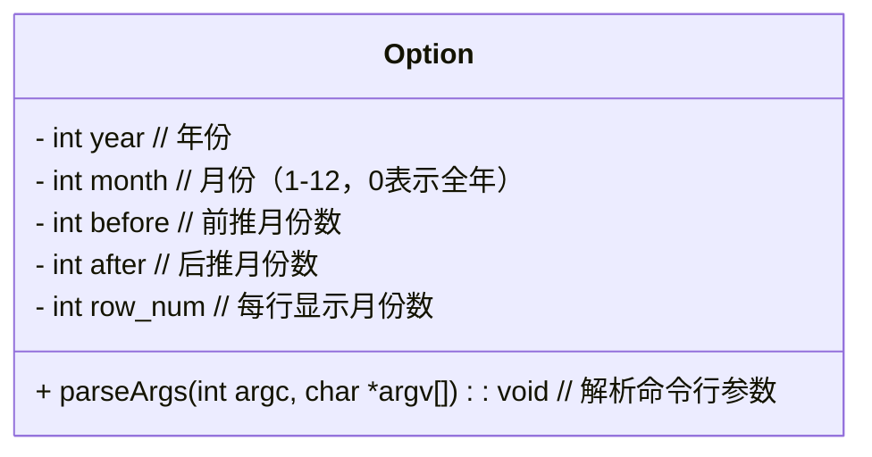
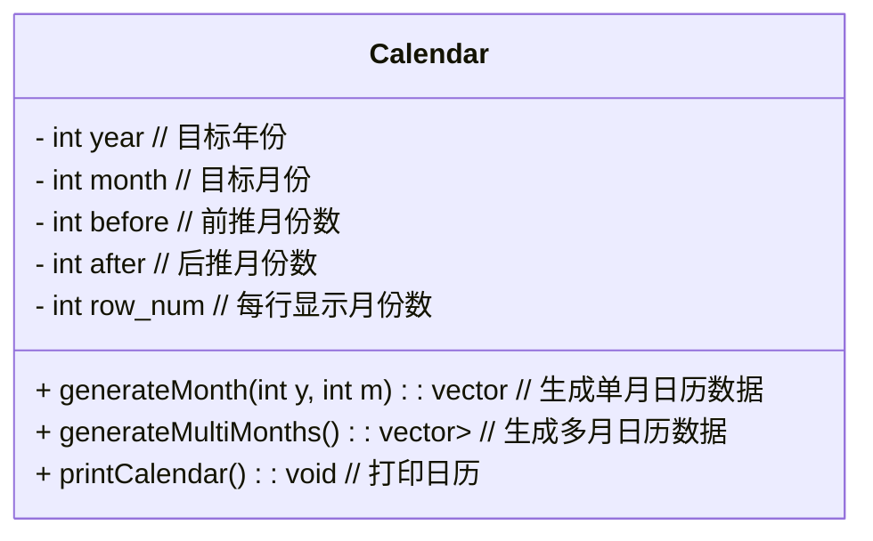
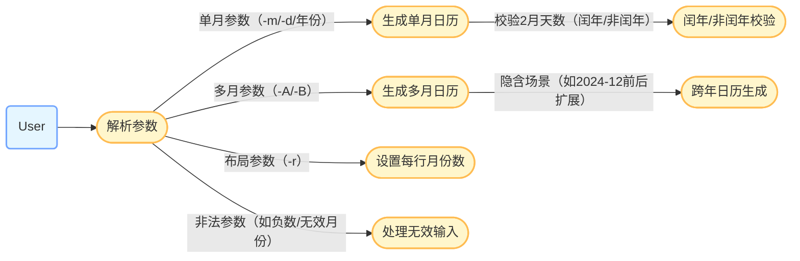

# 日历生成工具 README

## 项目概述
该工具实现了一个可配置的日历生成功能，支持通过命令行参数指定年份、月份、前后月份数量及每行显示月份数。核心功能由 `Option` 类（参数解析）和 `Calendar` 类（日历生成与打印）组成。


### 一、类图
#### 1. Option 类（选项解析类）


#### 2. Calendar 类（月历生成类）



### 二、类关系图


- **依赖关系**：`Option` 类解析参数后，将配置传递给 `Calendar` 类的构造函数，用于初始化日历生成规则。  
- **协作关系**：`Calendar` 类通过 `Option` 类的配置参数，调用 `generateMonth` 和 `generateMultiMonths` 生成日历数据，最终通过 `printCalendar` 输出。


## 测试说明
测试使用test.bat进行测试，脚本放置在../test/路径下

### 用例图



### 用例说明
| 用例名称            | 对应测试场景               | 说明                                                             |
| ------------------- | -------------------------- | ---------------------------------------------------------------- |
| **解析参数**        | 所有测试用例的参数输入部分 | 解析命令行参数，校验合法性（如年份>0、月份1-12）                 |
| **生成单月日历**    | 测试1-5、测试21-22         | 处理单月请求（当前月、指定月、闰年2月、非闰年2月）               |
| **生成多月日历**    | 测试6-19、测试15-16        | 处理前后扩展月份请求（-A/-B），支持跨年（如2024-12后推至2025年） |
| **设置每行月份数**  | 测试10-11、测试17-18       | 通过 `-r` 参数控制每行显示月份数（如单列、多列布局）             |
| **处理无效输入**    | 测试23-27                  | 捕获非法参数（如月份13、年份0、负数-A/B、无效参数名）            |
| **跨年日历生成**    | 测试14-16、测试19          | 自动处理跨年度月份（如2024年12月前推至11月2024，后推至1月2025）  |
| **闰年/非闰年校验** | 测试21-22                  | 验证2月天数（闰年29天，非闰年28天）                              |


### 关键场景映射
1. **正常功能**：  
   - 单月生成：对应测试1-5、21-22（含闰年逻辑）。  
   - 多月生成：对应测试6-19（含跨年逻辑，如测试15-16）。  
   - 布局控制：对应测试10-11、17-18（`-r` 参数）。  

2. **异常处理**：  
   - 无效月份/年份：测试23-24（如`-m 13`、`-d 0000-01`）。  
   - 非法参数值：测试25（`-A -1`）、测试26（无效参数`-x`）。  
   - 过多参数：测试27（输入超过预期参数数量）。  

3. **边界测试**：  
   - 最小年份`1900`：测试20。  
   - 最大扩展月份（如`-A 11`覆盖全年）：测试16。  


此用例图全面覆盖了测试脚本中的功能点和异常场景，清晰展示了用户与系统的交互逻辑及核心测试目标。


## 四、使用说明
### 命令行参数
```bash
Usage: cal [-A months] [-B months] [-d yyyy-mm] [-r rownum] [-m month] [yyyy]
```
| 参数          | 说明                                                           |
| ------------- | -------------------------------------------------------------- |
| `-A <months>` | 后推显示的月份数（如 `-A 2` 显示当前月以及之后 2 个月）        |
| `-B <months>` | 前推显示的月份数（如 `-B 1` 显示当前月以及之前 1 个月）        |
| `-d <date>`   | 指定日期（格式：`yyyy-mm`，如 `-d 2025-06` 显示 2025 年 6 月） |
| `-r <num>`    | 每行显示的月份数（默认值为3）                                  |
| `-m <month>`  | 指定月份                                                       |
| `[yyyy]`      | 指定年份，输出全年日历                                         |
| `[yyyy mm]`   | 指定年月                                                       |

### 示例
```bash
# 显示当前年份全年日历（等价于 cal -m 0）
cal

# 显示 2025 年全年日历
cal 2025

# 显示当前月前后各 1 个月（共 3 个月），每行 2 个月
cal -B 1 -A 1 -r 2

# 显示 2025 年 10 月及后推 2 个月，每行 1 个月
cal -m 10 -A 2 -r 1 2025

# 显示 2025-12 单月日历（通过 -d 参数指定）
cal -d 2025-12
```


## 五、代码结构
### 核心类说明
1. **`Option` 类**  
   - **职责**：解析命令行参数，处理参数校验、默认值设置（如当前日期）。  
   - **关键方法**：`parseArgs` 方法使用 `getopt` 解析参数，并验证年份、月份等合法性。

2. **`Calendar` 类**  
   - **职责**：根据配置生成单月或多月日历数据，并格式化打印。  
   - **关键方法**：  
     - `generateMonth`：使用 `std::tm` 和 `mktime` 计算日期，生成单月日历的文本行。  
     - `generateMultiMonths`：处理全年或前后月份的逻辑，调用 `generateMonth` 生成多月数据。  
     - `printCalendar`：按行分组打印多月日历，确保格式对齐。

### 依赖项
- **C++ 标准库**：`ctime`（日期处理）、`vector`（数据存储）、`iostream`（输入输出）。  
- **第三方库**：`fmt`（字符串格式化，需包含 `<fmt/core.h>` 和 `<fmt/chrono.h>`）。


## 六、注意事项
1. 月份范围：`-m` 参数需为 `1-12`（单月）或 `0`（全年），否则程序将报错退出。  
2. 年份合法性：年份需大于 `0`，否则默认使用当前年份。  
3. 格式对齐：日历输出通过空格填充实现对齐，不同终端可能显示略有差异。